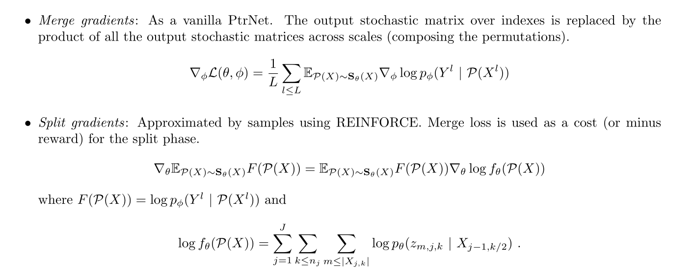

# Divide and Conquer Networks (DiCoNet)


Code accompanying [Divide and Conquer Networks](https://arxiv.org/pdf/1611.02401.pdf)
Modified by Leopold Ehrlich to test and identify the inner workings, aiming to establish or disprove parity with existing algorithms.
# DiCoNet Summary
## Model


## Weak supervision Loss


## Gradients computation



# Reproduce Experiments
## Prerequisites

- Python 3.6.1 + some traditional libraries
- Computer with Linux or OSX
- [PyTorch](http://pytorch.org)
- For training, an NVIDIA GPU is needed. CPU not supported.

## Convex Hull
### Baseline
```
python code/ConvexHull2d/main.py --path [experiment folder] --path_dataset [dataset folder]
```
### Without split computational regularization
```
python code/ConvexHull2d/main.py --path [experiment folder] --path_dataset [dataset folder] --dynamic
```
### Add split computational regularization
```
python code/ConvexHull2d/main.py --path [experiment folder] --path_dataset [dataset folder] --dynamic --regularize_split
```

## K-means

Check the parse arguments section at the top of the kmeans.py file to change the default arguments.
```
python code/K-means/main.py --path [experiment folder] --path_dataset [dataset folder] --dataset ["GM"/"CIFAR"]
```

## Knapsack

Compile the knapsack solver for the creation of the dataset.
```
g++ src/Knapsack/solver.cc -O2 -o src/Knapsack/solver
```
Train the model. Check the parse arguments section at the top of the knapsack.py file to change the default arguments.
```
python src/Knapsack/knapsack.py --dataset_path [dataset folder] --solver_path src/Knapsack/solver --logs_path [experiment folder]
```


